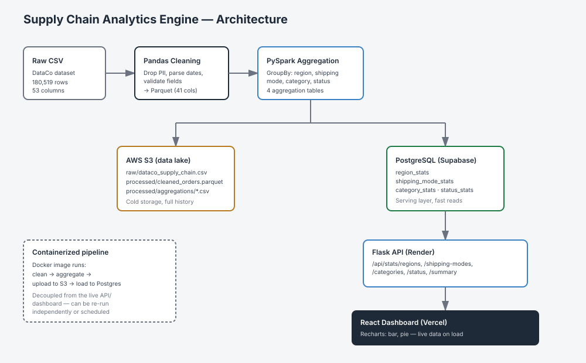
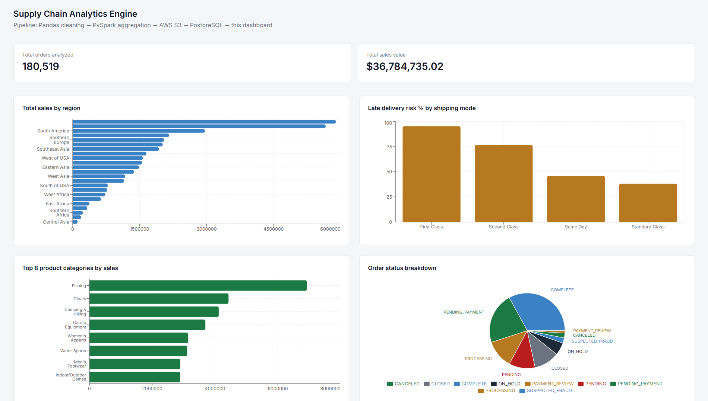

# Supply Chain Analytics Engine

## Try it live

[Dashboard](https://supply-chain-analytics-engine.vercel.app) — pulls live data from the deployed Flask API.

A cloud-based data pipeline that ingests, cleans, and aggregates 180,000+ supply chain order records, storing raw and processed data in AWS S3 and serving analytics through a live dashboard.

## Problem it solves
Raw operational data (orders, shipments, delivery performance) is only useful once it's cleaned, aggregated, and made queryable. This pipeline automates that end-to-end: from a messy 53-column raw dataset to a live dashboard showing sales by region, late-delivery risk by shipping mode, and category performance.

## Features
- Data cleaning and PII removal with Pandas (180,519 records processed)
- Distributed aggregation with PySpark across 4 business dimensions (region, shipping mode, category, order status)
- Cloud storage of raw + processed data in AWS S3
- Aggregated results served from PostgreSQL via a Flask REST API
- Live analytics dashboard (React + Recharts)
- Fully containerized pipeline (Docker) for reproducible runs

## Tech stack
- **Pipeline:** Python, Pandas, PySpark, Docker
- **Cloud storage:** AWS S3, boto3
- **Backend API:** Flask, Gunicorn, PostgreSQL (Supabase)
- **Frontend:** React (Vite), Tailwind CSS, Recharts

## Architecture

**Pipeline flow:** Raw CSV → Pandas cleaning (drops PII, parses dates, validates data) → saved as Parquet → PySpark aggregation (4 groupBy analyses) → results uploaded to S3 (raw + processed) and loaded into PostgreSQL → Flask API serves aggregated stats → React dashboard renders live charts.

**Key design decisions:**
- Raw and cleaned data live in S3 (the "data lake" layer); only aggregated summary tables live in Postgres (the "serving layer") — the dashboard never queries 180K raw rows directly, keeping it fast.
- Parquet used over CSV for intermediate storage — columnar format, smaller size, preserves types.
- Pipeline runs as a single containerized process (Docker), decoupled from the API/dashboard, so it can be re-run independently (e.g., on a schedule) without touching the live app.

## Setup (run the pipeline locally)
1. `pip install -r requirements.txt`
2. Add `.env` with `DATABASE_URL`, `AWS_ACCESS_KEY_ID`, `AWS_SECRET_ACCESS_KEY`, `AWS_REGION`, `S3_BUCKET_NAME`
3. Place the DataCo Supply Chain dataset at `data/raw/dataco_supply_chain.csv`
4. `python src/clean.py && python src/aggregate.py && python src/upload_to_s3.py && python src/load_to_postgres.py`

Or run it containerized: `docker build -t supply-chain-pipeline . && docker run --env-file .env supply-chain-pipeline`

## Screenshots
